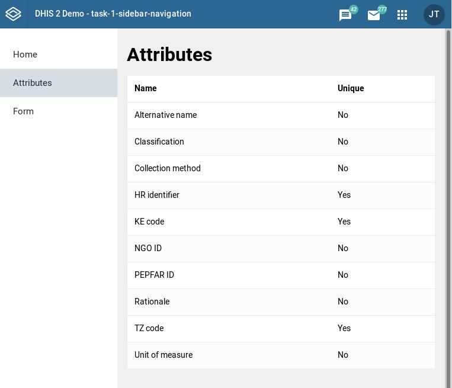
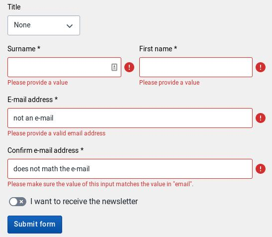

# Empty UI Libraries template for completing the tasks

* [1. Introduction](#intro)
  * [UI Libraries recap](#intro--recap)
  * [Webinar tasks introduction](#intro--webinar-into)
* [2. Training environment](#training-environment)
  * [If you're using your local development environment](#training-environment--local-dev)
* [3. Structure inside the `src` folder](#src-structure)
* [4. Task 1 - Create a navigation with the Menu and MenuItem component](#task-1)
  * [Existing code in the template](#task-1--existing-code)
  * [Completing the task](#task-1--completing-the-task)
* [5. Task 2 - Create a Table for the attributes that are being loaded](#task-2)
  * [Existing code in the template](#task-2--existing-code)
  * [Completing the task](#task-2--completing-the-task)
* [6. Task 3 - Complete the registration form](#task-3)
  * [Existing code in the template](#task-3--existing-code)
  * [Completing the task](#task-3--completing-the-task)
    * [The validation](#task-3--validation)
* [7. Solution for all three tasks](#solution)

<a name="intro" href=""></a>
## 1. Introduction

<a name="intro--recap" href=""></a>
### UI Libraries recap

At DHIS2 we have a design system which is a collection of design principles and
a library of UI components for designing applications for the DHIS2 platform.
Using this system you can design and build applications that are usable,
powerful and consistent with other DHIS2 applications.

The UI library is our implementation of that design system for react
environments. It's used by the DHIS2 core developers as well as by 3rd party
dhis2 apps.

*You can watch Joe Cooper's **presentation about the design system**, held online on
the 2nd of June, on [YouTube](https://youtu.be/oi9mSa62G0Q?t=1860).*

The main library, called `ui`, is the complete library and re-exports all
components from our individual libraries. It's therefore the better choice when
developing apps as it exports the components in a flat structure and works
independent of structural changes in our individual libraries.

*You can watch Jan-Gerke Salomon's **presentation about the ui libraries**, held
online on the 2nd of June as well, on
[YouTube](https://youtu.be/oi9mSa62G0Q?t=2353).*

It can be added to a project with both npm and yarn:

**npm:**
```bash
npm install @dhis2/ui --save-prod
```

**yarn:**
```bash
yarn add @dhis2/ui
```

<a name="intro--webinar-intro" href=""></a>
### Webinar tasks introduction

There are three tasks to be completed. The first one is required for the next
two as it sets up the routing to reach the pages.

All files that you have to touch contain explanatory comments, even for code
that's irrelevant to the task or hasn't been covered yet during the webinar.

The comments that are important are the ones containing `@TODO`, that's where
action is required by you in order to complete the task.

<a name="training-environment" href=""></a>
## 2. Training environment

You can access the code sandbox with the template here:
[https://codesandbox.io/s/github/dhis2/academy-web-app-dev-2020/tree/master/workshop-1/02-ui-libraries/ui-libraries-task-template](https://codesandbox.io/s/github/dhis2/academy-web-app-dev-2020/tree/master/workshop-1/02-ui-libraries/ui-libraries-task-template)

It is read-only, so you need to fork it in order to work on it.
The `@dhis2/ui` library is already installed, so you don't need to worry about
that. You can start hacking right away.

<a name="training-environment--local-dev" href=""></a>
### If you're using your local development environment

IMPORTANT NOTICE: We're not supporting local development during the webinar. So
if you're trying this and run into complications, please switch to using the
sandbox linked to above.

The webinar will introduce the code sandbox as development environment as it
works OS independently. If you're reading this at a later time or want to use
your local development environment, here are the steps required to get the
template working:

```bash
git clone https://github.com/dhis2/academy-web-app-dev-2020
cd academy-web-app-dev-2020
yarn install # or just "yarn", which is a short hand for "yarn install"
yarn start
```

This should open the url `https://localhost:3000` in your default browser and
will automatically refresh when you change your code. This is how we develop
apps at dhis2.

<a name="src-structure" href=""></a>
## 3. Structure inside the `src` folder

```
|- /src
|    # Navigation module
|--- /navigation
|------ Navigation.js
|    # Contains the page components
|--- /views
|------ Home.js
|------ Attributes.js
|------ Form.js
|       # Redirects to the homepage
|------ NoMatch.js
|    # Contains the routing
|--- App.js
```

<a name="task-1" href=""></a>
## 4. Task 1 - Create a navigation with the Menu and MenuItem component

The goal of this task is to have a fully functional sidebar.
The sidebar is required to navigate to the pages you will work on in the next
two tasks. This shouldn't take more than a couple of minutes as this is more an
introductory task.

<a name="task-1--existing-code" href=""></a>
### Existing code in the template

The template already contains all necessary code except for the ui components.
You don't have to worry about creating the app or compose the routing.

The page consists of three pages:

1. Homepage
1. Attributes
1. Form

The components for these pages can be found in `src/views/`, but they don't need
to be touched in order to get this working.

The `src/App.js` renders a component called `Navigation`. It already exists in
`src/navigation/Navigation.js`. This is the file that you have to work on.

<a name="task-1--completing-the-task" href=""></a>
### Completing the task

Once all steps have been completed, the sidebar should look like this:


As you can see, there are three menu items. These are already prepared in the
code of the navigation, but the actual components are missing.

You'll have to import both the `Menu` and the `MenuItem` components from
`@dhis2/ui`.

Then you can replace the placeholder elements (look for the `@TODO` comments)
with the components you just imported.

If all the components have been added correctly, you should be able to navigate
to the `Home`, `Attributes` and `Form` pages, which so far display nothing but
an `h1`.

<a name="task-2" href=""></a>
## 5. Task 2 - Create a Table for the attributes that are being loaded

After the sidebar has been added, you can navigate to the attributes page.
On this page some attributes are being loaded from the database. 
These should then be displayed in a table.

If you did not complete the first task, you can't navigate to this page.
You can still access is through manually changing the url to `/attributes`.

<a name="task-2--existing-code" href=""></a>
### Existing code in the template

The file you are going to work on is `src/views/Attributes.js`. It already
contains all the loading logic and will display the loading indicator to the
user ("Loading...") and the error message of something goes wrong.

The introduction to loading data from dhis2 will be held after the introduction
of the ui libraries, so for now, you won't have to worry about how this works.
There are three values (`loading`, `error` & `data`) and the `data` one is the
only one that you have to handle.

While the data is loading, it'll be `null` and once the fetching of the data
has finished & succeeded, data will have the following shape:

```js
{
    attributes: {
        attributes: [
            {
                id: string,
                displayName: string,
                unique: bool,
            }
        ]
    }
}
```

<a name="task-2--completing-the-task" href=""></a>
### Completing the task

Once all steps have been completed, the attributes page should look like this:



The components required to complete the task are:

* `Table`
* `TableBody`
* `TableCell`
* `TableCellHead`
* `TableHead`
* `TableRow`
* `TableRowHead`

So first you need to import them at the top of the file. There's a comment with
`@TODO` that mentions all the required components as well.

The basic structure of the table is already in place, the comments in the jsx
portion of the code will let you know which components you need and where to
place them.

As `data.attributes.attributes` is an array, you'll have to map each item to a
table row that displays the relevant data. When one correctly, each row will
have two cells, one for the `displayName` and one for whether the attribute is
`unique` or not.

<a name="task-3" href=""></a>
## 6. Task 3 - Complete the registration form

The final task will be the one that will take most of the time.
The goal is to have a fully functional form that won't submit until all
required fields have a value and their value is not invalid.

If you did not complete the first task, you can't navigate to this page.
You can still access is through manually changing the url to `/form`.

<a name="task-3--existing-code" href=""></a>
### Existing code in the template

The form logic is done with react-final-form, which we use for building forms.
The setup of the form is already in place, so you don't have to worry about
setting up the react-final-form components.

The form is almost complete, the only components missing are the components
and the validators from the ui library.

The file that you will have to work on is `src/views/Form.js`.

<a name="task-3--completing-the-task" href=""></a>
### Completing the task

Once all steps have been completed, the attributes page should look like this:


If the form validation fails, then the form should contains the respective
error message. In the following image all fields that have a validation
function are invalid:



<a name="task-3--validation" href=""></a>
#### The validation

The validation for the individual fields should be as follows:

1. `surname`
   * Can't be empty
1. `firstname`
   * Can't be empty
1. `email`
   * Can't be empty
   * Must be a valid e-mail address
1. `email-validation`
   * Can't be empty
   * Must match the value of the `email` field

The `hasValue` validator can be used to check whether a field is empty or not.

```jsx
validate={hasValue}
```

The `email` validator can be used to check whether a field is a valid email
address.

```jsx
validate={email}
```

The `createEqualTo` factory function can be used to create a validator that
makes sure the field's value matches the value of the field with supplied name.

```jsx
validate={createEqualTo('email')}
```

If a field needs multiple validators, the `composeValidators` function can be
used to use as many as needed:

```jsx
validate={composeValidators(
    email,
    hasValue,
    createEqualTo('email')
)}
```

All validators mentioned above in this task are exported directly from
`@dhis2/ui`. You can easily write your own validators in your apps. Please
refer to the docs of
[`react-final-form`](https://final-form.org/docs/react-final-form/getting-started)
for more information.

The comments with `@TODO` in the `Form.js` will tell you which components and
validators to use.

<a name="solution" href=""></a>
## 7. Solution for all three tasks

If you think you're done, you can compare your result with the solution here:
[https://github.com/dhis2/academy-web-app-dev-2020/tree/master/workshop-1/02-ui-libraries/ui-libraries-task-solution](https://github.com/dhis2/academy-web-app-dev-2020/tree/master/workshop-1/02-ui-libraries/ui-libraries-task-solution)

You can find the live solution here:
[https://codesandbox.io/s/github/dhis2/academy-web-app-dev-2020/tree/master/workshop-1/02-ui-libraries/ui-libraries-task-solution](https://codesandbox.io/s/github/dhis2/academy-web-app-dev-2020/tree/master/workshop-1/02-ui-libraries/ui-libraries-task-solution)
